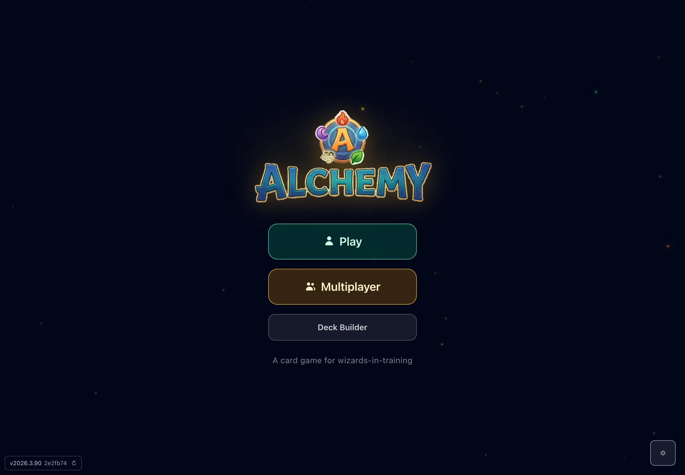
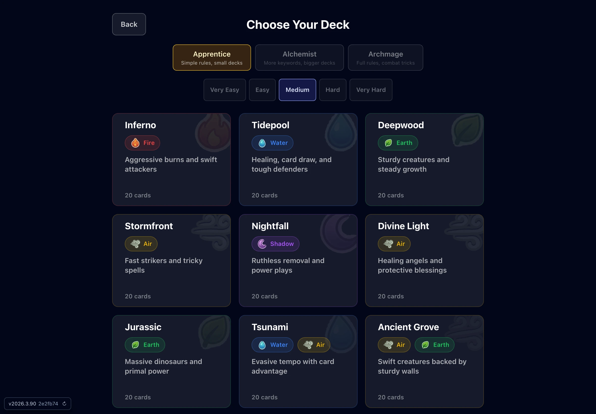
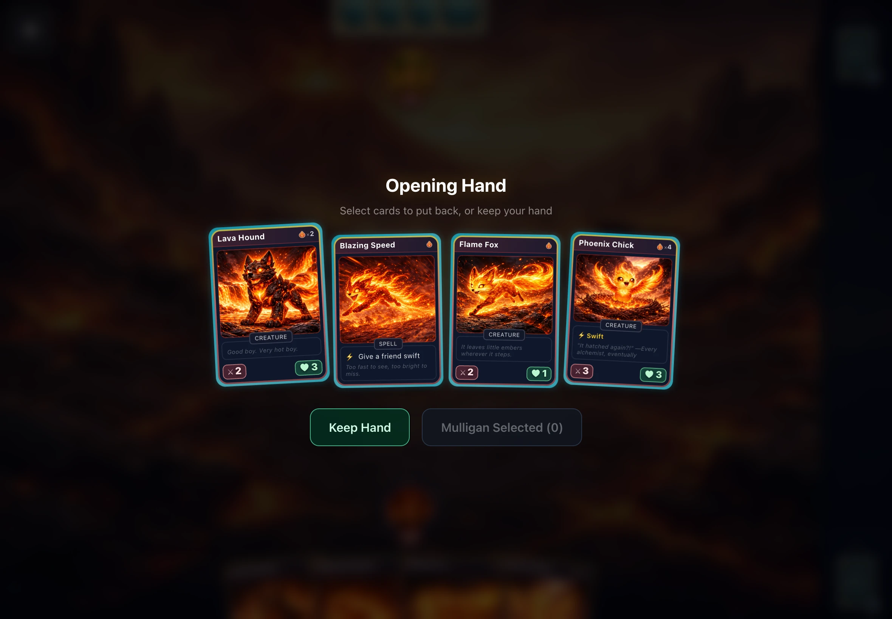

<p align="center">
  
</p>

<p align="center">
  <em>A card game for wizards-in-training</em>
</p>

<p align="center">
  <a href="https://github.com/matthewevans/alchemy/actions/workflows/deploy-pages.yml">
    
  </a>
  <a href="https://matthewevans.github.io/alchemy/">
    
  </a>
  
  
</p>

<br />

<p align="center">
  <a href="https://matthewevans.github.io/alchemy/">
    
  </a>
</p>

<br />

## Features

- **Elemental card battles** — five elements (fire, water, earth, air, shadow) with a rock-paper-scissors color wheel
- **MTG-inspired combat** — tap to attack, assign blockers, spells and keywords — simplified for ages 6–10
- **9 starter decks** — mono and dual-element archetypes, each with a unique playstyle
- **3 difficulty tiers** — Apprentice, Alchemist, and Archmage rulesets with scaling complexity
- **5 AI difficulties** — from Very Easy to Very Hard, with distinct AI personalities
- **Deck builder** — craft custom decks from the full card pool
- **Peer-to-peer multiplayer** — real-time 1v1 via WebRTC with 5-character room codes
- **Persistent state** — games auto-save to IndexedDB and resume across sessions
- **PWA-ready** — installable on any device for offline play

<p align="center">
  
  
  
</p>

## Quick Start

```bash
pnpm install
pnpm dev
```

## Stack

| | |
|---|---|
| **UI** | React 19, TypeScript, Vite, Tailwind CSS |
| **State** | Zustand with subscribeWithSelector |
| **Engine** | Pure-function reducer, seeded PRNG, deterministic replay |
| **Network** | PeerJS (WebRTC) for peer-to-peer multiplayer |
| **Audio** | Web Audio API — procedural SFX + ambient music |
| **Storage** | IndexedDB for game state, deck sharing via URL codes |
| **Testing** | Vitest, Testing Library, Cypress E2E |

## Build & Test

```bash
pnpm build          # TypeScript check + production build
pnpm test           # Vitest (single run)
pnpm lint           # ESLint
```

## Deployment

GitHub Pages deploys automatically from `main` via `.github/workflows/deploy-pages.yml`.

## License

MIT. See [LICENSE](./LICENSE).
